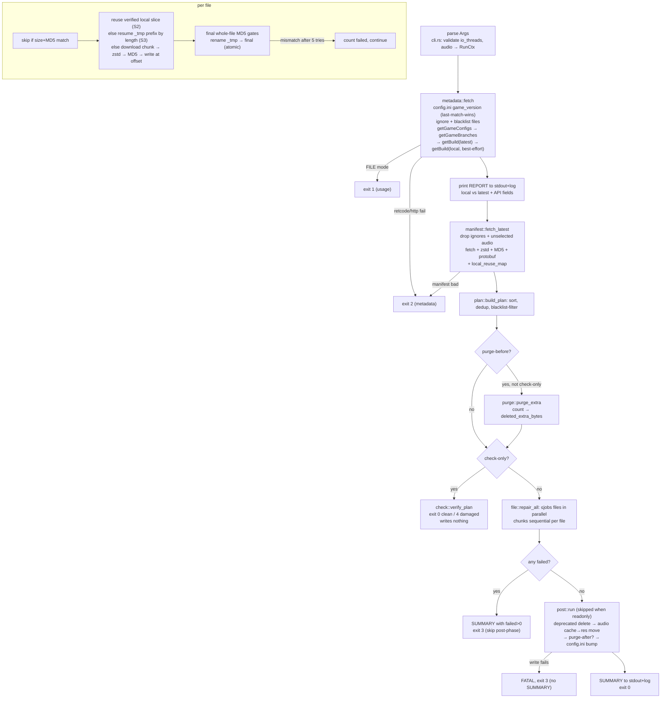

# girpr — Genshin Impact low-disk repair patcher

Brings a possibly-corrupt, possibly-any-older-version Genshin install to the
current live version with minimal extra disk. **Unattended by design:**
args in, exit code + `REPORT`/`SUMMARY` stdout lines out, no UI.

Core = **Starward's repair-in-chunk-mode** (version-agnostic, per-file
`{path}_tmp` streaming repair, verified local-chunk reuse, atomic promote)
**+ Collapse's extra-file purge** as a pre/post phase.
Background: `docs/01-findings-and-verdict.md`, spec: `docs/02-repair-chunk-spec.md`,
module plan: `docs/03-rust-implementation-plan.md`.

## For developers / AI agents — read this first

`src/main.rs` is a thin shim (parse → tracing → run → `SUMMARY` → exit). All
behavior is in the library; `src/repair/mod.rs::run` is the pipeline
coordinator and holds no logic beyond phase order and the exit-code contract.

**Entry points.**

| File | Owns | Key symbols |
|---|---|---|
| `src/main.rs` | shim: `Args::parse` → `init_tracing` → `repair::run` → `SUMMARY` → `exit` | `main` |
| `src/lib.rs` | module map + re-exports | — |
| `src/cli.rs` | clap `Args`, audio-lang normalization, flag validation | `Args`, `Args::into_ctx`, `parse_audio_selection`, `normalize_audio_lang`, `is_audio_none` |
| `src/config.rs` | validated run config; failure carrying the exit code | `RunCtx`, `RunCtx::readonly`, `RunCtx::api_bases`, `RunFailure` |
| `src/logging.rs` | console layer + always-`TRACE` file layer | `init_tracing`, `log_file_path` |
| `src/report.rs` | run counters + every stdout line of the contract | `Summary`, `Summary::snapshot`, `emit`, `format_report_line`, `format_progress`, `emit_progress`, `format_summary_line`, `spawn_progress_reporter` |
| `src/biz.rs` | biz/channel/launcher/game-id mapping | `Biz::endpoints`, `Biz::channel_tuple` |
| `src/hyp.rs` | HoYoPlay + Sophon JSON APIs | `HypClient::new`, `HypClient::new_with_bases`, `game_config`, `game_branch`, `chunk_build`, `deprecated_files`, `production_bases` |
| `src/sophon.rs` | chunk-manifest protobuf, fetch+verify+parse, manifest filter, local chunk map | `select_manifests`, `fetch_manifest`, `fetch_chunk_bytes`, `build_local_chunk_map`, `join_url` |
| `src/repair/mod.rs` | phase coordinator, exit-code contract | `run` |
| `src/repair/metadata.rs` | local state + server metadata (docs/02 1–2) | `fetch`, `Meta` |
| `src/repair/manifest.rs` | manifest fetch + local chunk-reuse map (3) | `fetch_latest`, `local_reuse_map`, `LocalChunkMap` |
| `src/repair/plan.rs` | work list (4) | `build_plan`, `RepairPlan`, `RepairPlan::expected_paths`, `PlannedFile` |
| `src/repair/purge.rs` | Collapse files-cleanup (5, 7) | `purge_extra`, `keep_set`, `classify_purge_path`, `PurgeVerdict` |
| `src/repair/check.rs` | `--check-only` verification (6.5) | `verify_plan` |
| `src/repair/file.rs` | per-file repair: reuse vs download, promote (6) | `repair_all`, `ChunkStats`, `Repaired` |
| `src/repair/post.rs` | deprecated/audio/`config.ini` + cleanup-after (7) | `run` |
| `src/repair/audio.rs` | audio scan-file format (used by 1 and 7) | `resolve_effective_audio`, `read_scan_file`, `write_scan_file` |
| `src/util.rs` | MD5, `config.ini`, ignore/blacklist files, rel-path normalization | `md5_file`, `md5_file_slice`, `file_len`, `read_game_version`, `write_config_ini`, `read_ignore_categories`, `read_blacklist`, `normalize_rel` |
| `tests/repair_offline.rs` | offline integration/e2e (mock API) | one `#[tokio::test]` per behavior |
| `tests/common/mod.rs` | mock server + deterministic fixture | `MockServer`, `build_fixture`, `MockOpts` |

**Action graph** — what one `repair::run(ctx)` does (numbers = `docs/02` steps):



**Machine contracts (do not break without updating tests + this table).**

- stdout: `REPORT …` once after metadata; `PROGRESS …` every 10 s;
  `SUMMARY total=… skipped=… repaired=… failed=… download_bytes=… deleted_extra_bytes=… exit=…`.
  `--json-summary` emits `REPORT`/`SUMMARY` as JSON objects instead.
- stderr: structured `tracing` logs (`--log-level` / `RUST_LOG`); always mirrored at
  `TRACE` to `<exe-dir>/logs/girpr_<timestamp>.log`.
- exit codes: `0` ok (check-only: intact) · `1` usage/config · `2` metadata/network ·
  `3` write/verify (per-file `Ok(summary,3)` with `SUMMARY`, or fatal `Err` with `FATAL` only) ·
  `4` check-only found damage.
- read-only modes: `--dry-run` and `--check-only` write nothing (no purge, no scan-file,
  no `config.ini`, byte counters stay 0; purge lists are only logged).
- purge: `--purge-before` and `--purge-after` run the **same** `purge::purge_extra`
  (expected set = live-manifest paths + `config.ini` + `audio_lang_*`/`Audio_*_pkg_version`
  patterns; **everything else purges**, incl. temps, exe, logs, `ScreenShot/`).
- audio: omitted flag = keep scan file (default `en-us` if unreadable); explicit list/`none`
  overwrites the scan file. `none` never mixes with langs.
- per-file spans: `file{seq,total,task,path}` — `grep 'path=<file>'` groups a file's lifecycle.

**Deliberate simplifications (do NOT "fix" without reading the linked code).**
S1 whole-blob buffering (`sophon.rs`, `repair/file.rs`) · S2 same-file-only chunk reuse
(`repair/file.rs`, `sophon::build_local_chunk_map`) · S3 resume-by-length + final-MD5 gate
(`repair/file.rs`). Purge keep-set is `config.ini`-only (`purge::keep_set`). Version parse is
last-match-wins (`util::read_game_version`, Starward parity).

## Requirements / build / usage

- Rust 1.80+; network to HoYoPlay + Sophon CDNs (production runs only).
- Game dir (read/write); free bytes ≈ `io_threads × largest file` beyond the game.

```powershell
cargo build --release
# Preview (writes nothing)
.\target\release\girpr --game-path "D:\Genshin Impact game" --biz hk4e_global --purge-after --dry-run
# Verify only; exit 4 if damaged
.\target\release\girpr --game-path "D:\Genshin Impact game" --biz hk4e_global --check-only
# Repair + purge extras
.\target\release\girpr --game-path "D:\Genshin Impact game" --biz hk4e_global --purge-after --io-threads 4
```

| Flag | Default | Meaning |
|---|---|---|
| `--game-path <DIR>` | (required) | Install dir (`config.ini`, `*_Data`, …) |
| `--biz <BIZ>` | (required) | `hk4e_cn` \| `hk4e_global` \| `hk4e_bilibili` |
| `--audio <LANG>`… | keep current, else `en-us` | Repeatable: `zh-cn`, `en-us`, `ja-jp`, `ko-kr`; `none` = game-only (overwrites scan file) |
| `--io-threads <N>` | `4` | Concurrent **files** (chunks per file sequential → HDD-friendly). SSD 4–8, HDD 1–2 |
| `--purge-after` / `--purge-before` | off | Same files-cleanup, different timing (before frees repair space) |
| `--check-only` | off | Verify size+MD5; writes nothing |
| `--dry-run` | off | Log actions; writes nothing |
| `--json-summary` | off | `REPORT`/`SUMMARY` as JSON |
| `--log-level <LVL>` | `info` | `error`/`warn`/`info`/`debug`/`trace` (`RUST_LOG` also honored) |

## Testing (offline by construction)

```powershell
cargo test            # 32 unit + 10 integration, all offline
cargo test --test repair_offline
cargo clippy --all-targets
```

- No test touches the internet: every case builds a `MockServer` on
  `127.0.0.1:<ephemeral>` and injects it via `RunCtx::hyp_base_override` /
  `sophon_base_override` (`src/config.rs`; resolved in `src/repair/metadata.rs`;
  `HypClient::new_with_bases` in `src/hyp.rs`).
- Binary-level e2e without code changes: set `GIRPR_HYP_BASE` / `GIRPR_SOPHON_BASE`
  env vars (explicit overrides win over env; both win over production) — resolved
  in `RunCtx::api_bases`.
- Mock shapes mirror live `hk4e_global` responses (Sept 2026): same wrappers,
  node names, int-or-string sizes, `url_prefix + "/" + id` joining. `getBuild?tag=<unknown>`
  returns `retcode -202` to exercise the local-build fallback.
- Fixture: 2 files / 3 chunks with fixed bytes (`build_fixture`); chunk fetches are
  logged (`mock.chunk_hits()`) so reuse/resume tests assert exact download sets.
- Unit tests sit next to the code they cover, one `mod tests` per module: pure
  phases only (plan, purge classification, audio scan file, `config.ini`, REPORT/
  SUMMARY formatting, flag validation, manifest filter, local chunk map).
- To add a case: extend `MockOpts` (deprecated list, audio dirs) or the fixture,
  then write one `#[tokio::test]` calling `repair::run` and asserting
  `(summary, exit code)` + on-disk state. Use `jobs=1` when asserting chunk order.

## How it keeps disk usage low

1. Files-cleanup (`--purge-before`/`--purge-after`): delete everything not in the live manifest.
2. Skip intact files (size + full MD5): 0 bytes for healthy files.
3. Chunk-level repair: only missing/corrupt chunks fetched; unchanged chunks copied from
   verified local slices (hash-gated, network fallback).
4. Per-file temp + atomic move: transient cost is one `_tmp` beside the file — no
   game duplicate, no blob store, no zip staging.
5. Post-phase: deprecated files, audio cache→res move, optional purge, `config.ini` bump.

v1 gap: expected set = latest Sophon manifest paths only (no dispatcher union, no
SDK/WPF/plugin zips — game launches without them). Chunk-repair only: no hdiff,
no 7z legacy path, no predownload, no speed limiter. Reruns are idempotent
(intact skipped, partial `_tmp` resumed by length, final MD5 re-verified).
